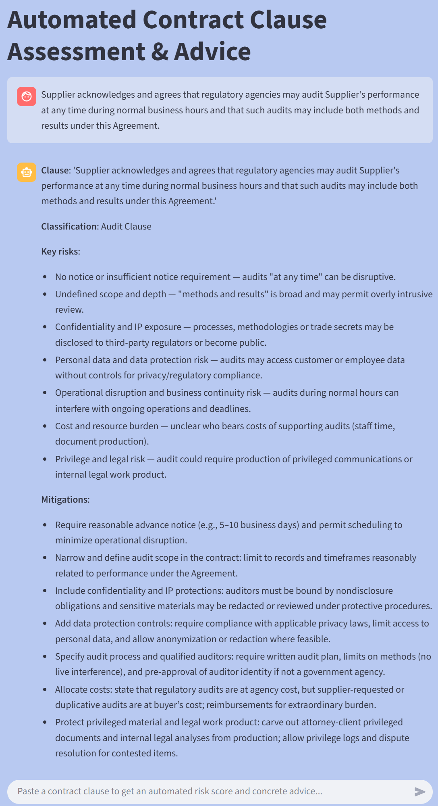

# ClauseGuard — Automated Contract Clause Classification & Risk Advice

Automate contract clause understanding end-to-end: classify clauses with fine-tuned LegalBERT and RoBERTa, then generate risk analysis and mitigation guidance with GPT-5 via the OpenAI API.

## Objective

Build a fast, explainable chatbot that:

- classifies pasted contract clauses into predefined categories (audit clause or not), and

- produces concise risk summaries and actionable mitigation steps.

**Why audit clause analysis matters**:
An audit clause is a contract term that gives one party (usually the customer) the right to inspect and verify the other party’s compliance with the agreement and applicable laws. It typically covers access to records, systems, facilities, personnel, and relevant subcontractors, and sets rules for scope, frequency, notice, confidentiality, costs, and remediation. Manual clause review is costly and error-prone—especially across large contract sets. Automating first-pass triage lets experts, such as lawyers, legal analysts, and compliance officers, focus on the tricky edge cases.

**Use cases**:
- Pre-signing: red-flag review for risk (termination, liability caps, indemnities).
- Post-signing: obligations tracking & audit readiness.
- Vendor / third-party risk: detect missing or weak security/privacy terms.
- Compliance: map clauses to internal policies or regulatory controls.

## Models
- LegalBERT (fine-tuned): domain-specific BERT trained on legal corpora; excels on legal tasks due to in-domain pretraining. 
- RoBERTa (baseline): strong general-purpose encoder; used here as a non-domain baseline. 
- GPT-5 via OpenAI API: generates risk narratives and mitigation steps from the classifier outputs and raw clause text using the Chat Completions API.

## Technologies
- Python — core language.
- Hugging Face Transformers / PyTorch — load & fine-tune encoders, inference pipelines.
- OpenAI API — GPT-family models for risk analysis & explanations.
- Streamlit — lightweight chat UI for interactive reviews.

## Results

| model                               | Average Accuracy | Average Precision | Average Recall |   Average F1 |
| ----------------------------------- | ---------------: | ----------------: | -------------: | -----------: |
| **nlpaueb/legal-bert-base-uncased** |     **0.985978** |      **0.983289** |   **0.990100** | **0.986616** |
| roberta-base                        |         0.965365 |          0.982300 |       0.949845 |     0.965152 |

**Why LegalBERT wins on this dataset (concise):**
- Domain pretraining: LegalBERT is pretrained on legal corpora; this better captures legalese, boilerplate structures, and clause-specific terminology.
- Reduced domain shift: Compared with general RoBERTa, LegalBERT’s vocabulary/statistics align with contracts, improving recall on nuanced clause types.

## Demo (Streamlit):

Paste a clause in the chat. The app returns:
- Clause classification result,
- Key risks & short rationale (GPT-5),
- Practical mitigation steps.

## Conclusion

This project delivers an end-to-end, automated workflow that pairs domain-tuned encoders (fine-tuned LegalBERT and RoBERTa) with GPT-5 to classify contract clauses and generate concise, actionable risk guidance. On our dataset, LegalBERT outperforms the general-purpose RoBERTa baseline, highlighting the value of in-domain pretraining for legal text. The Streamlit chat interface makes the system practical for first-pass review and triage, helping legal and compliance teams move faster while keeping experts in the loop.

Note: This tool supports—not replaces—professional judgment. Future improvements may include retrieval-augmented analysis, richer explainability, calibration of risk scores, and on-prem deployment options for sensitive data.

## References

- [LegalBench Dataset](https://huggingface.co/datasets/nguha/legalbench)
- [Hugging Face Transformers Documentation](https://huggingface.co/transformers/)
- [OpenAI Chat Completions API](https://platform.openai.com/docs/api-reference/chat/create)
- [Streamlit](https://streamlit.io/)
- [Cross Validation Techniques](https://machinelearningmastery.com/k-fold-cross-validation/)
- [Fine Tuned Legal-Bert](https://huggingface.co/Prakarsha01/fine-tuned-legal-bert-5folds)
- [RoBERTa] (https://huggingface.co/docs/transformers/en/model_doc/roberta)